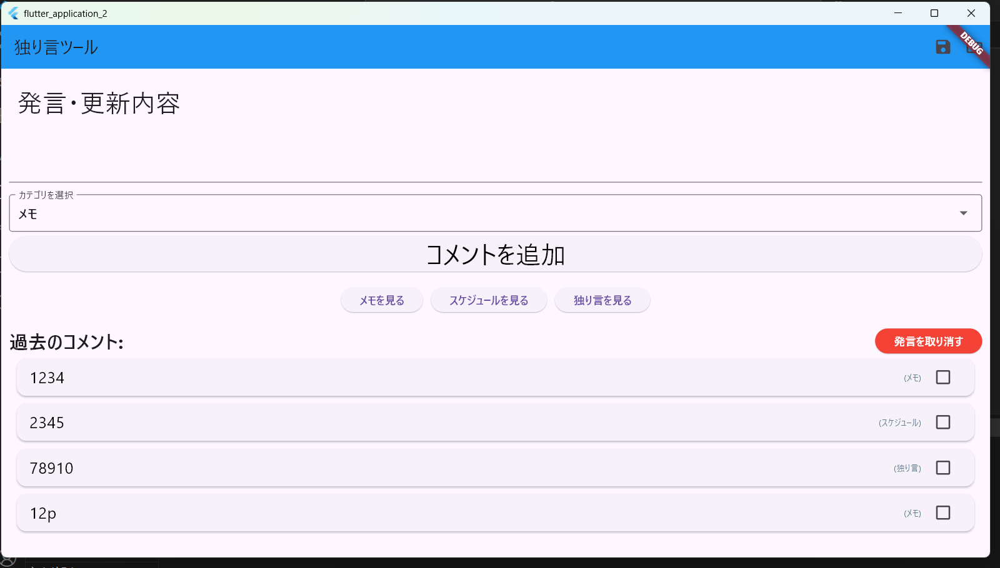

# コード
```
import 'package:flutter/material.dart';
import 'dart:io'; // ファイル操作用
import 'package:path_provider/path_provider.dart'; // アプリケーションのドキュメントディレクトリ取得用
import 'dart:convert'; // JSONエンコード・デコード用

void main() {
  runApp(MyApp());
}

// コメントとそのチェック状態、カテゴリを保持するカスタムクラス
class CommentItem {
  String text;
  bool isChecked;
  String category; // 新しく追加: コメントが属するカテゴリ

  CommentItem({
    required this.text,
    this.isChecked = false,
    required this.category,
  });

  // CommentItemをJSONに変換するメソッド
  Map<String, dynamic> toJson() => {
    'text': text,
    'isChecked': isChecked,
    'category': category,
  };

  // JSONからCommentItemを生成するファクトリコンストラクタ
  factory CommentItem.fromJson(Map<String, dynamic> json) {
    return CommentItem(
      text: json['text'] as String,
      isChecked: json['isChecked'] as bool,
      category: json['category'] as String,
    );
  }
}

class MyApp extends StatelessWidget {
  @override
  Widget build(BuildContext context) {
    return MaterialApp(
      title: '独り言ツール', // アプリ名を変更
      theme: ThemeData(
        primaryColor: const Color(0xff2196f3), // メインの青色
        canvasColor: const Color(0xFFE0E0E0), // 背景色
      ),
      home: MyHomePage(),
    );
  }
}

class MyHomePage extends StatefulWidget {
  MyHomePage({Key? key}) : super(key: key);
  @override
  _MyHomePageState createState() => _MyHomePageState();
}

class _MyHomePageState extends State<MyHomePage> {
  static var _message = '発言・更新内容';
  static final _controller = TextEditingController();
  final List<CommentItem> _comments = []; // CommentItemオブジェクトのリストに変更

  // カテゴリのリスト
  final List<String> _categories = ['メモ', 'スケジュール', '独り言'];
  String? _selectedCategory; // 現在選択されているカテゴリ

  // ファイル保存用のファイル名
  final _fname = 'soliloquy_data.json';

  @override
  void initState() {
    super.initState();
    _selectedCategory = _categories[0]; // 初期値を設定
    _loadComments(); // アプリ起動時にコメントをロード
  }

  @override
  Widget build(BuildContext context) {
    return Scaffold(
      appBar: AppBar(
        title: const Text('独り言ツール'),
        backgroundColor:
            Theme.of(context).primaryColor, // ThemeDataのprimaryColorを適用
        actions: [
          IconButton(
            icon: const Icon(Icons.save),
            onPressed: () => _saveComments(context),
            tooltip: 'コメントを保存',
          ),
          IconButton(
            icon: const Icon(Icons.folder_open),
            onPressed: () => _loadComments(context: context), // contextを渡す
            tooltip: 'コメントをロード',
          ),
        ],
      ),
      body: Column(
        mainAxisAlignment: MainAxisAlignment.start,
        mainAxisSize: MainAxisSize.max,
        crossAxisAlignment: CrossAxisAlignment.stretch,
        children: <Widget>[
          Padding(
            padding: const EdgeInsets.all(20.0),
            child: Text(
              _message,
              style: const TextStyle(
                fontSize: 32.0,
                fontWeight: FontWeight.w400,
                fontFamily: "Roboto",
              ),
            ),
          ),
          Padding(
            padding: const EdgeInsets.all(10.0),
            child: TextField(
              controller: _controller,
              style: const TextStyle(
                fontSize: 28.0,
                color: Color.fromARGB(255, 23, 21, 21),
                fontWeight: FontWeight.w400,
                fontFamily: "Roboto",
              ),
            ),
          ),
          // カテゴリ選択ドロップダウン
          Padding(
            padding: const EdgeInsets.symmetric(
              horizontal: 10.0,
              vertical: 5.0,
            ),
            child: DropdownButtonFormField<String>(
              value: _selectedCategory,
              decoration: const InputDecoration(
                labelText: 'カテゴリを選択',
                border: OutlineInputBorder(),
              ),
              items:
                  _categories.map((String category) {
                    return DropdownMenuItem<String>(
                      value: category,
                      child: Text(category),
                    );
                  }).toList(),
              onChanged: (String? newValue) {
                setState(() {
                  _selectedCategory = newValue;
                });
              },
            ),
          ),
          Padding(
            padding: const EdgeInsets.symmetric(horizontal: 10.0),
            child: ElevatedButton(
              child: const Text(
                "コメントを追加",
                style: TextStyle(
                  fontSize: 32.0,
                  color: Color(0xff000000),
                  fontWeight: FontWeight.w400,
                  fontFamily: "Roboto",
                ),
              ),
              onPressed: addComment,
            ),
          ),
          const SizedBox(height: 20.0),
          // ナビゲーションボタンの追加
          Padding(
            padding: const EdgeInsets.symmetric(horizontal: 10.0),
            child: Wrap(
              // Wrapを使ってボタンが画面幅に合わせて折り返すようにする
              spacing: 10.0, // ボタン間の横方向スペース
              runSpacing: 10.0, // ボタン行間の縦方向スペース
              alignment: WrapAlignment.center, // ボタンを中央揃え
              children:
                  _categories.map((category) {
                    return ElevatedButton(
                      onPressed: () {
                        Navigator.push(
                          context,
                          MaterialPageRoute(
                            builder:
                                (context) => CategoryScreen(
                                  categoryTitle: category,
                                  allComments: _comments, // 全コメントを渡す
                                ),
                          ),
                        );
                      },
                      child: Text('$categoryを見る'),
                    );
                  }).toList(),
            ),
          ),
          const SizedBox(height: 20.0),
          Padding(
            padding: const EdgeInsets.symmetric(horizontal: 10.0),
            child: Row(
              mainAxisAlignment: MainAxisAlignment.spaceBetween,
              children: [
                const Text(
                  '過去のコメント:',
                  style: TextStyle(
                    fontSize: 24.0,
                    fontWeight: FontWeight.bold,
                    fontFamily: "Roboto",
                  ),
                ),
                ElevatedButton(
                  onPressed: deleteSelectedComments,
                  style: ElevatedButton.styleFrom(backgroundColor: Colors.red),
                  child: const Text(
                    '発言を取り消す',
                    style: TextStyle(color: Colors.white),
                  ),
                ),
              ],
            ),
          ),
          Expanded(
            child: ListView.builder(
              itemCount: _comments.length,
              itemBuilder: (BuildContext context, int index) {
                final comment = _comments[index];
                return Card(
                  margin: const EdgeInsets.symmetric(
                    horizontal: 20.0,
                    vertical: 5.0,
                  ),
                  elevation: 2.0,
                  child: ListTile(
                    trailing: Checkbox(
                      value: comment.isChecked,
                      onChanged: (bool? newValue) {
                        setState(() {
                          comment.isChecked = newValue!;
                        });
                      },
                    ),
                    // 発言内容とカテゴリを並べて表示
                    title: Row(
                      mainAxisAlignment:
                          MainAxisAlignment.spaceBetween, // 両端に配置
                      children: [
                        Expanded(
                          // 発言内容が長くなっても対応できるようにExpandedで囲む
                          child: Text(
                            comment.text,
                            style: TextStyle(
                              fontSize: 20.0, // 発言内容のフォントサイズ
                              decoration:
                                  comment.isChecked
                                      ? TextDecoration.lineThrough
                                      : TextDecoration.none,
                              color:
                                  comment.isChecked
                                      ? Colors.grey
                                      : Colors.black,
                            ),
                            overflow: TextOverflow.ellipsis, // 長すぎる場合に省略記号
                          ),
                        ),
                        // カテゴリ表示（発言内容の半分くらいのサイズ）
                        Text(
                          '(${comment.category})',
                          style: TextStyle(
                            fontSize: 10.0, // 発言内容(20.0)の約半分
                            color:
                                comment.isChecked
                                    ? Colors.grey
                                    : Colors.blueGrey, // カテゴリの色
                          ),
                        ),
                      ],
                    ),
                    onTap: () {
                      setState(() {
                        comment.isChecked = !comment.isChecked;
                      });
                    },
                  ),
                );
              },
            ),
          ),
        ],
      ),
    );
  }

  void addComment() {
    setState(() {
      if (_controller.text.isNotEmpty && _selectedCategory != null) {
        _message =
            '入力: ' + _controller.text + ' (カテゴリ: ' + _selectedCategory! + ')';
        _comments.add(
          CommentItem(text: _controller.text, category: _selectedCategory!),
        );
        _controller.clear();
        _saveComments(context); // コメント追加後に自動保存
      } else {
        _message = 'コメントとカテゴリを選択してください。';
      }
    });
  }

  void deleteSelectedComments() {
    setState(() {
      _comments.removeWhere((item) => item.isChecked);
      _message = '選択されたコメントを削除しました。';
      _saveComments(context); // コメント削除後に自動保存
    });
  }

  // ファイルパスを取得するヘルパー関数
  Future<File> _getDataFile(String filename) async {
    final directory = await getApplicationDocumentsDirectory();
    return File('${directory.path}/$filename');
  }

  // コメントをファイルに保存する
  void _saveComments(BuildContext context) async {
    try {
      final file = await _getDataFile(_fname);
      final jsonList = _comments.map((item) => item.toJson()).toList();
      await file.writeAsString(jsonEncode(jsonList));
      ScaffoldMessenger.of(
        context,
      ).showSnackBar(const SnackBar(content: Text('コメントを保存しました！')));
    } catch (e) {
      ScaffoldMessenger.of(
        context,
      ).showSnackBar(SnackBar(content: Text('コメントの保存に失敗しました: $e')));
    }
  }

  // コメントをファイルからロードする
  Future<void> _loadComments({BuildContext? context}) async {
    try {
      final file = await _getDataFile(_fname);
      if (await file.exists()) {
        final contents = await file.readAsString();
        final List<dynamic> jsonList = jsonDecode(contents);
        setState(() {
          _comments.clear();
          _comments.addAll(jsonList.map((json) => CommentItem.fromJson(json)));
        });
        if (context != null) {
          ScaffoldMessenger.of(
            context,
          ).showSnackBar(const SnackBar(content: Text('コメントをロードしました！')));
        }
      } else {
        if (context != null) {
          ScaffoldMessenger.of(
            context,
          ).showSnackBar(const SnackBar(content: Text('保存されたコメントはありません。')));
        }
      }
    } catch (e) {
      if (context != null) {
        ScaffoldMessenger.of(
          context,
        ).showSnackBar(SnackBar(content: Text('コメントのロードに失敗しました: $e')));
      }
    }
  }

  @override
  void dispose() {
    _controller.dispose();
    super.dispose();
  }
}

// 新しいカテゴリ画面（MyHomePageの下に定義）
class CategoryScreen extends StatelessWidget {
  final String categoryTitle; // 画面のタイトルとフィルタリング対象のカテゴリ名
  final List<CommentItem> allComments; // 全コメントのリスト

  CategoryScreen({required this.categoryTitle, required this.allComments});

  @override
  Widget build(BuildContext context) {
    // 選択されたカテゴリに属するコメントのみをフィルタリング
    final filteredComments =
        allComments
            .where((comment) => comment.category == categoryTitle)
            .toList();

    return Scaffold(
      appBar: AppBar(
        title: Text(categoryTitle), // カテゴリ名をタイトルに
        backgroundColor: Theme.of(context).primaryColor, // AppBarの背景色をテーマから取得
      ),
      body:
          filteredComments.isEmpty
              ? const Center(child: Text('このカテゴリにはまだコメントがありません。'))
              : ListView.builder(
                itemCount: filteredComments.length,
                itemBuilder: (BuildContext context, int index) {
                  final comment = filteredComments[index];
                  return Card(
                    margin: const EdgeInsets.symmetric(
                      horizontal: 20.0,
                      vertical: 5.0,
                    ),
                    elevation: 2.0,
                    child: ListTile(
                      // カテゴリ画面でも同じ表示形式にする
                      title: Row(
                        mainAxisAlignment: MainAxisAlignment.spaceBetween,
                        children: [
                          Expanded(
                            child: Text(
                              comment.text,
                              style: const TextStyle(fontSize: 20.0),
                              overflow: TextOverflow.ellipsis,
                            ),
                          ),
                          Text(
                            '(${comment.category})',
                            style: const TextStyle(
                              fontSize: 10.0,
                              color: Colors.blueGrey,
                            ),
                          ),
                        ],
                      ),
                    ),
                  );
                },
              ),
    );
  }
}
```

```
メモ、スケジュール、独り言でカテゴリ分けて表示可
入力内容のsave機能付き
```


